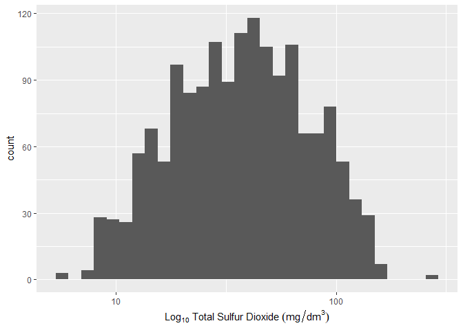

Introduction
------------

This report explores the attributes of red wines, and attempts to link
these attributes with quality ratings by wine experts. By the end of
this report, we should have gained some insight into the characteristics
of 'good' red wine, as rated by experts.

Loading the data set
--------------------

The red wines data set contains nearly 1600 observations and 12
attributes, including density, alcohol content, and acidity. Each
observation has a wine expert's rating, designated by the column
quality.

Of course, in the real world wine quality is very subjective. Given,
however, that quality rating in the dataset is published by experts, its
consistency is likely to be superior to ratings by the general public.

    ##  [1] "X"                    "fixed.acidity"        "volatile.acidity"    
    ##  [4] "citric.acid"          "residual.sugar"       "chlorides"           
    ##  [7] "free.sulfur.dioxide"  "total.sulfur.dioxide" "density"             
    ## [10] "pH"                   "sulphates"            "alcohol"             
    ## [13] "quality"

    ## 'data.frame':    1599 obs. of  13 variables:
    ##  $ X                   : int  1 2 3 4 5 6 7 8 9 10 ...
    ##  $ fixed.acidity       : num  7.4 7.8 7.8 11.2 7.4 7.4 7.9 7.3 7.8 7.5 ...
    ##  $ volatile.acidity    : num  0.7 0.88 0.76 0.28 0.7 0.66 0.6 0.65 0.58 0.5 ...
    ##  $ citric.acid         : num  0 0 0.04 0.56 0 0 0.06 0 0.02 0.36 ...
    ##  $ residual.sugar      : num  1.9 2.6 2.3 1.9 1.9 1.8 1.6 1.2 2 6.1 ...
    ##  $ chlorides           : num  0.076 0.098 0.092 0.075 0.076 0.075 0.069 0.065 0.073 0.071 ...
    ##  $ free.sulfur.dioxide : num  11 25 15 17 11 13 15 15 9 17 ...
    ##  $ total.sulfur.dioxide: num  34 67 54 60 34 40 59 21 18 102 ...
    ##  $ density             : num  0.998 0.997 0.997 0.998 0.998 ...
    ##  $ pH                  : num  3.51 3.2 3.26 3.16 3.51 3.51 3.3 3.39 3.36 3.35 ...
    ##  $ sulphates           : num  0.56 0.68 0.65 0.58 0.56 0.56 0.46 0.47 0.57 0.8 ...
    ##  $ alcohol             : num  9.4 9.8 9.8 9.8 9.4 9.4 9.4 10 9.5 10.5 ...
    ##  $ quality             : int  5 5 5 6 5 5 5 7 7 5 ...

Univariate Plots Section
------------------------

### Quality Ratings

What is the distribution of quality ratings in our dataset?

    ##    Min. 1st Qu.  Median    Mean 3rd Qu.    Max. 
    ##   3.000   5.000   6.000   5.636   6.000   8.000

Our average rating is 5.6 and our median rating is 6. This tells us that
our data is slightly right-skewed, a view supported by our histogram
above.

A very small number of observations fall to each end of the
distribution. Very few wines are rated lowest (quality rating 3) and
very few wines are rated highest (quality rating of 8).

### Acidity

Acids are among the most important components of red wine. Acid
concentration, in milligrams per liter of wine, is typically higher than
most other compounds in wine. Additional information can be found here:
(<http://waterhouse.ucdavis.edu/whats-in-wine/red-wine-composition>)

Acids are what give wine its sour taste. They conteract and balance the
sweetness that arises from sugars, natural or otherwise, present in
grapes from which wine is made. Fixed acids typically originate in the
grapes, while volatile acids are mostly produced by microbial and yeast
action during fermentation.

It will therefore be quite instructive to see what the acidity levels
are of wines in our data.

Fixed acidity and volatile acidity histograms above show that majority
of wines seem to have moderate acidity.

    ##    Min. 1st Qu.  Median    Mean 3rd Qu.    Max. 
    ##    4.60    7.10    7.90    8.32    9.20   15.90

    ##    Min. 1st Qu.  Median    Mean 3rd Qu.    Max. 
    ##  0.1200  0.3900  0.5200  0.5278  0.6400  1.5800

Units or measurement are same for both acid types. There is much more
fixed acids in wine than volatile.

Fixed acids range from 4.6 to 15.9, with the mean of 8.3.

Volatile acids range from 0.12 to 1.58, with a mean of 0.52.

Both distributions appear to be close to normal, with a few outliers.

### Residual sugar

To make wine, yeast and bacteria are introduced to grapes, which then
proceed to feast on the natural sugars present in the grapes in what is
called the fermentation process. The sugar left over, not consumed by
bacteria and yeast, are referred to as residual sugar.

    ##    Min. 1st Qu.  Median    Mean 3rd Qu.    Max. 
    ##   0.900   1.900   2.200   2.539   2.600  15.500

Values for residual sugar have huge dispersion, ranging from 1 to 16.
The bulk of the values seem to lie between 1 and 5, with many outliers.
I wonder what the plots will look like if we apply limits to narrow the
range, say from 1 to 5. I would also like to see what log-transformed
residual sugar looks like, side by side. Lets plot three graphs.

Certainly, using either the range-limited data or the log-transformed
data will be preferable to using the raw data. I think I will use the
log-transform for further analysis, since I preserve all records thusly.

### Alcohol

Alcohol is produced by yeast as they metabolise the natural sugars in
grape. Wine makers have developed finely calibrated methods to stop or
inhibit this metabolism in order to actualise the desired level of
alcohol content. Let us see how alcohol content, given as a percentage
of volume, is distributed in our data set.

Alcohol values sit mainly between 9.5% and 13%. Wines with higher
alcohol content seem to attract higher ratings.

    ##    Min. 1st Qu.  Median    Mean 3rd Qu.    Max. 
    ##    8.40    9.50   10.20   10.42   11.10   14.90

50% of observations in the dataset have alcohol content ranging from
9.5% to 11.1%. Lowest is 8.4% and highest is 14.9%. This pretty much
matches what we observe with wine bottles in the wild, or rather, in
shopping aisles.

### Sulfur dioxide

Alcohol in wine is produced as metabolic waste when yeast microbes
digest grape sugars. Sulphur dioxide is added to the mixture at
different stages to stop or otherwise inhibit this microbial action.
Furthermore, while suphur dioxide is typically odorless and tasteless in
low quantities, it can be detected when present in higher
concentrations, manifesting in the nose and taste of wine.

Total sulfur dioxide is highly skewed. Let's apply a log transformation

Applying log transformation does help minimise the skewedness of the
distribution. We will therefore use log transformed total sulphur
dioxide for subsequent analysis.

### Sulphates

In our dataset, sulphates are shown in a seperate column from total
sulfur dioxide and free sulfur dioxide. These three are all related.
Sulphates, or potassium sulphate, is added to wine and some of it gets
converted to sulphur dioxide. Both compounds act to limit microbial
action, thereby stopping or slowing the fermentation process and helping
preserve the properties of the wine mixture.

Seeing we have reviewed the range spread of sulfur dioxide, let us do
the same with potassium sulphate.

First, we look at the range of values in a summary.

    ##    Min. 1st Qu.  Median    Mean 3rd Qu.    Max. 
    ##  0.3300  0.5500  0.6200  0.6581  0.7300  2.0000

Values range from 0.33 to 2. The table suggests the data will be heavily
skewed to the right.

Let us look at a histogram of these values. We will also plot a
log-transformed histogram side by side for comparison.

As expected, the values are skewed to the right. Using log10
transformation, we can restore normality to the distribution.

### Citric acid

Wikipedia says of citric acid:

> It is used less frequently than tartaric and malic due to the
> aggressive citric flavors it can add to the wine. When citric acid is
> added, it is always done after primary alcohol fermentation has been
> completed due to the tendency of yeast to convert citric into acetic
> acid. <https://en.wikipedia.org/wiki/Acids_in_wine>

I'm curious about this one. Do all wines have citric acid? If not,
what's the proportion of wines that contain it versus wines that do not?

    ## [1] "Proportion of wines with citric acid: 91.7%"

That's quite a high number: nearly 92% of wines have citric acid. Let's
see a summary of values, and plot a histogram.

    ##    Min. 1st Qu.  Median    Mean 3rd Qu.    Max. 
    ##   0.000   0.090   0.260   0.271   0.420   1.000

Will a log transform help with the skew observed above? Let us find out.

Log-transformation does not improve the data in terms of skewedness. We
will therefore use the non-transformed raw data.

### Density

In our data set, density is given as grams per cubic centimetre. Density
depends on alcohol and sugar content. Let's see a summary table.

    ##    Min. 1st Qu.  Median    Mean 3rd Qu.    Max. 
    ##  0.9901  0.9956  0.9968  0.9967  0.9978  1.0037

There's only a very small spread in the data, from 0.99 to 1. And
average density is 0.9967. Let's plot a histogram

Wow, density values appear to be almost perfectly normal. Out of
curiosity, I want to see a qqplot.

QQplot indicates density data forms a light tailed distribution,
confirming the observation from the histogram. Will be interesting to
see how density correlates to other attributes in our dataset.

Univariate Analysis
-------------------

### Structure of the Dataset

Red wines dataset has nearly 1600 observations and 12 attributes. These
are: fixed acidity, volatile acidity, citric acid, residual sugar,
chlorides, free sulfur dioxide, total sulfur dioxide, density, pH,
sulphates, alcohol and quality. Most of these attributes' values are
expressed in grams per cubic decimetre. Exceptions are density, alcohol
and quality, which do not measure a compound but rather measure an
overall attribute of the wine mixture.

### Featue of Interest

The main feature of interest is wine quality. Of the other given
attributes, we are keen to understand whether any of these could serve
as reliable predictors of wine quality.

Bivariate Plots Section
-----------------------

### Acdity and Quality

Let us now see how wine quality relates to acidity. We will use scatter
plots to find correlation.

The above scatter plots tell a curious story. I observe that levels of
fixed acidity in low quality and very high quality wines (3, 4, and 8)
are barely distinguishable. Furthermore, highest levels of fixed acidity
are associated with medium quality wines, in addition to a few wines
with a quality of 7. Nevertheless, the bulk of the distribution seems to
indicate wine fixed acidity does not predict wine quality.

With volatile acidity however, picture is slightly different. Highest
quality wines appear likely to have lower levels of volatile acids.

I will run a couple quick correlation tests to confirm this.

    ## 
    ##  Pearson's product-moment correlation
    ## 
    ## data:  wines$fixed.acidity and wines$quality
    ## t = 4.996, df = 1597, p-value = 6.496e-07
    ## alternative hypothesis: true correlation is not equal to 0
    ## 95 percent confidence interval:
    ##  0.07548957 0.17202667
    ## sample estimates:
    ##       cor 
    ## 0.1240516

    ## 
    ##  Pearson's product-moment correlation
    ## 
    ## data:  wines$volatile.acidity and wines$quality
    ## t = -16.954, df = 1597, p-value < 2.2e-16
    ## alternative hypothesis: true correlation is not equal to 0
    ## 95 percent confidence interval:
    ##  -0.4313210 -0.3482032
    ## sample estimates:
    ##        cor 
    ## -0.3905578

So for fixed acids, coefficient of 0.12 suggests that fixed acidity does
not correlate to quality. For volatile acidity however, there appears to
be a moderate negative correlation of acidity levels to quality.

In reality, volatile acids account for a much smaller proportion of the
red wine composition. It is therefore unlikely that volatile acids are
by themselves driving this correlation. It is much more likely we are
seeing a non-causative co-incidence.

Before moving on from acidity, I'm curious to see what the average
acidity is per quality level of wine.

One way I can see this view is in a box plot, as below.

Average fixed acidity does not vary much across the quality levels.
Wines of different quality levels will have very similar fixed acidity
levels. This is supported by our weak correlation coefficient above.
There are some interesting outliers however in the mid-range of quality,
not surprising given the high number of wine observations that fall into
this segment.

For volatile acids however, our plot seems to indicate an inverse
relationship between average volatile acidity and wine quality. This
agrees with observed moderate negative correlation coefficient. As
observed earlier however, volatile acids are a minor component of red
wines and it's unlikely they are a causative factor here.

An alternative way to get a sense of average acidity across quality
levels will be to group by quality and summarise acidity, that is, mean,
median etc.

Indeed, this view will be useful across all the wine attributes. I will
therefore now create a summary dataframe grouped by wine quality, and
from which I will calculate mean, median, min, max and count values for
each wine attribute.

    ## # A tibble: 6 x 46
    ##   quality mean_fixed.acid~ median_fixed.ac~ min_fixed.acidi~
    ##     <int>            <dbl>            <dbl>            <dbl>
    ## 1       3             8.36             7.5               6.7
    ## 2       4             7.78             7.5               4.6
    ## 3       5             8.17             7.8               5  
    ## 4       6             8.35             7.9               4.7
    ## 5       7             8.87             8.8               4.9
    ## 6       8             8.57             8.25              5  
    ## # ... with 42 more variables: max_fixed.acidity <dbl>,
    ## #   mean_volatile.acidity <dbl>, median_volatile.acidity <dbl>,
    ## #   min_volatile.acidity <dbl>, max_volatile.acidity <dbl>,
    ## #   mean_citric.acid <dbl>, median_citric.acid <dbl>,
    ## #   min_citric.acid <dbl>, max_citric.acid <dbl>,
    ## #   mean_residual.sugar <dbl>, median_residual.sugar <dbl>,
    ## #   min_residual.sugar <dbl>, max_residual.sugar <dbl>,
    ## #   mean_chlorides <dbl>, median_chlorides <dbl>, min_chlorides <dbl>,
    ## #   max_chlorides <dbl>, mean_free.sulfur.dioxide <dbl>,
    ## #   median_free.sulfur.dioxide <dbl>, min_free.sulfur.dioxide <dbl>,
    ## #   max_free.sulfur.dioxide <dbl>, mean_total.sulfur.dioxide <dbl>,
    ## #   median_total.sulfur.dioxide <dbl>, min_total.sulfur.dioxide <dbl>,
    ## #   max_total.sulfur.dioxide <dbl>, mean_density <dbl>,
    ## #   median_density <dbl>, min_density <dbl>, max_density <dbl>,
    ## #   mean_pH <dbl>, median_pH <dbl>, min_pH <dbl>, max_pH <dbl>,
    ## #   mean_sulphates <dbl>, median_sulphates <dbl>, min_sulphates <dbl>,
    ## #   max_sulphates <dbl>, mean_alcohol <dbl>, median_alcohol <dbl>,
    ## #   min_alcohol <dbl>, max_alcohol <dbl>, n <int>

We have now created our summary dataframe. It groups our data by wine
quality, and for each quality level summarises by showing mean, median,
min, max and count.

Let us now perform a visualization on acidity by seeing how the average
acidity by wine quality level

So I've run two plot types, histogram and line, of the means of fixed
acidity and volatile acidity. They both tell the same story.

Looking at the scale of the mean fixed acidity, it is clear there is
little difference in the means. Values only go from 7.75 to 8.8.
Volatile acids in contrast go from 0.4 to 0.9, and it's clear from this
view that lower volatiles are correlated with higher quality wines.
Again, given how little amounts of volatile acids are present in wine,
it is unlikely that by themselves they have an impact on quality rating.

### Residual sugar and Quality

Recall our raw residual sugar data is highly skewed, with most values
between 1 and 5. Nevertheless, let us see what raw data looks like in a
box plot versus quality.

I will run three boxplots of same data: raw data, limited data range 1
to 5, and log transformed data, and see if any interesting insights are
exposed.

The skewedness of the data is certainly reduced by both the limit
function and log-transformation. But we still observe significant
outliers in these box plots. For reasons of completeness of data, I will
continue to use the log-transformed values.

There does not appear to be significant difference in residual sugar
across the different levels of quality, from these box plots.

Again, let us apply a correlation test to this.

    ## 
    ##  Pearson's product-moment correlation
    ## 
    ## data:  residual.sugar and quality
    ## t = 0.5488, df = 1597, p-value = 0.5832
    ## alternative hypothesis: true correlation is not equal to 0
    ## 95 percent confidence interval:
    ##  -0.03531327  0.06271056
    ## sample estimates:
    ##        cor 
    ## 0.01373164

Just to be sure, let's run the test again, this time limiting residual
sugar to between 1 and 5 inclusive.

    ## 
    ##  Pearson's product-moment correlation
    ## 
    ## data:  residual.sugar and quality
    ## t = 0.4089, df = 1511, p-value = 0.6827
    ## alternative hypothesis: true correlation is not equal to 0
    ## 95 percent confidence interval:
    ##  -0.03989807  0.06088176
    ## sample estimates:
    ##        cor 
    ## 0.01051856

Let's run a third correlation test, this time using log-transformed
residual sugar.

    ## 
    ##  Pearson's product-moment correlation
    ## 
    ## data:  log10(residual.sugar) and quality
    ## t = 0.94071, df = 1597, p-value = 0.347
    ## alternative hypothesis: true correlation is not equal to 0
    ## 95 percent confidence interval:
    ##  -0.02551727  0.07247084
    ## sample estimates:
    ##        cor 
    ## 0.02353331

As expected, in all three tests correlation coefficient is very low at
around 0.01 or 0.2. We can therefore say residual sugar does not appear
to have a direct impact on quality rating. This is not a surprising
outcome. I imagine a sweet wine and a sour wine can have similar rating;
and there are many other factors that come into play in judging the
quality of the wine, besides acidity and sweetness.

So far, we've looked at acidity and residual sugar, two of the most
important characteristics of wine in terms of composition. And we've
found no strong correlation to quality among these two.

There are two other attributes I want to look at, that seem to account
for big chunks of wine composition: alcohol and sulfur dioxide. Let's
take the fun one first: alcohol.

### Alcohol and Quality

The boxplot shows quality rating increases with higher average alcohol
content. This is an interesting and amusing finding!

Let's run a correlation test to confirm this.

    ## 
    ##  Pearson's product-moment correlation
    ## 
    ## data:  alcohol and quality
    ## t = 21.639, df = 1597, p-value < 2.2e-16
    ## alternative hypothesis: true correlation is not equal to 0
    ## 95 percent confidence interval:
    ##  0.4373540 0.5132081
    ## sample estimates:
    ##       cor 
    ## 0.4761663

Correlation coefficient is 0.47. While this does not reach the 0.7 mark
to qualify as a strong correlation, it is a significant number. So we
can say alcohol appears to have a moderate positive correlation with
wine quality rating. My friends will tell me I did not need to run a
correlation test to discover this!

### Sulfur dioxide and Quality

Running a box plot on the raw sulfur dioxide data, we obtain the graph
below.

Total sulfur dioxide is highly skewed. Let's apply a log transformation

Applying log transform, we reduce the skewedness of the distribution. We
can now see with greater confidence that total sulfur dioxide appears to
have very little bearing on quality rating. We can see this in the
boxplot, from the mean values across different quality ratings.

Let's run a correlation test to confirm this.

    ## 
    ##  Pearson's product-moment correlation
    ## 
    ## data:  total.sulfur.dioxide and quality
    ## t = -7.5271, df = 1597, p-value = 8.622e-14
    ## alternative hypothesis: true correlation is not equal to 0
    ## 95 percent confidence interval:
    ##  -0.2320162 -0.1373252
    ## sample estimates:
    ##        cor 
    ## -0.1851003

    ## 
    ##  Pearson's product-moment correlation
    ## 
    ## data:  log10(total.sulfur.dioxide) and quality
    ## t = -6.8999, df = 1597, p-value = 7.476e-12
    ## alternative hypothesis: true correlation is not equal to 0
    ## 95 percent confidence interval:
    ##  -0.2173510 -0.1221403
    ## sample estimates:
    ##        cor 
    ## -0.1701427

We have performed two tests, one with the raw but skewed total sulfur
dioxide values, and the second with log-transformed values. Both tell
the same tale: very low negative correlation coefficient. My hunch
appears to be incorrect.

### Alcohol and Sulfur Dioxide

But is alcohol content negatively correlated with sulfur dioxide?
Remember that sulfur dioxide is added to wine to inhibit yeast action,
that is, to stop fermentation.

Let's do a scatter plot to find out.

    ## 
    ##  Pearson's product-moment correlation
    ## 
    ## data:  log10(total.sulfur.dioxide) and alcohol
    ## t = -9.4818, df = 1597, p-value < 2.2e-16
    ## alternative hypothesis: true correlation is not equal to 0
    ## 95 percent confidence interval:
    ##  -0.2767472 -0.1839183
    ## sample estimates:
    ##       cor 
    ## -0.230858

So from looking at both the scatter plot and the correlation
coefficient, we can say there is a weak negative correlation between
sulfur dioxide and alcohol content. So it is incorrect to assume higher
levels of sulfur dioxide translate to lower levels of alcohol. Curious
result, but quite instructive nonetheless.

### Sulphates and Quality

Let us now see how sulphates are distributed across quality levels, in a
box plot. Our univariate exploration showed how skewed the rar data is,
so we will use the log transformed data directly.

From the box plot, it appears that wines with higher amount of sulphates
tend to have higher quality. We get this view visually by looking at the
means. But is this really what the data suggests?

Let's use a scatter plot and a correlation test.

    ## 
    ##  Pearson's product-moment correlation
    ## 
    ## data:  sulphates and quality
    ## t = 10.38, df = 1597, p-value < 2.2e-16
    ## alternative hypothesis: true correlation is not equal to 0
    ## 95 percent confidence interval:
    ##  0.2049011 0.2967610
    ## sample estimates:
    ##       cor 
    ## 0.2513971

Scatter plot and correlation test indicate there is only a weak
relationship between amount of sulphates in wine and quality rating.

### Citric Acid and Quality

Do we observe a correlation between citric acid and quality? We will use
a scatter plot, box plot and correlation test to investigate

    ## 
    ##  Pearson's product-moment correlation
    ## 
    ## data:  citric.acid and quality
    ## t = 9.2875, df = 1597, p-value < 2.2e-16
    ## alternative hypothesis: true correlation is not equal to 0
    ## 95 percent confidence interval:
    ##  0.1793415 0.2723711
    ## sample estimates:
    ##       cor 
    ## 0.2263725

Citric acid appears to have a weak correlation to quality, but at 0.22
this is too weak to draw a reliable conclusion. The box plot helps us
infer that this correlation may be influenced by outliers at quality
levels 4 and 7.

### Density and Quality

How does density differ by quality rating? Let's use a facet wrap on
density histogram to find out

It's apparent that a normal distribution of density is present across
all quality ratings. Let us use a box plot to see if quality related
differences can be exposed.

Interestingly, the mean density decreases the higher up in wine rating
we go. So denser wines rate lower? This surprises me. Let's run a
scatter plot

Here we compare quality to density. There appears to be a very weak
negative correlation of density to quality. Let's calculate the
correlation coefficient between density and quality.

    ## 
    ##  Pearson's product-moment correlation
    ## 
    ## data:  density and quality
    ## t = -7.0997, df = 1597, p-value = 1.875e-12
    ## alternative hypothesis: true correlation is not equal to 0
    ## 95 percent confidence interval:
    ##  -0.2220365 -0.1269870
    ## sample estimates:
    ##        cor 
    ## -0.1749192

As suspected, a weak negative correlation exists between density and
quality. Still, quite surprising. I would have expected higher density
wines to be rated higher.

### Density and Alcohol

I'll test to confirm the correlation between density and alcohol
content.

First, a scatter plot, and then a correlation test.

    ## 
    ##  Pearson's product-moment correlation
    ## 
    ## data:  density and alcohol
    ## t = -22.838, df = 1597, p-value < 2.2e-16
    ## alternative hypothesis: true correlation is not equal to 0
    ## 95 percent confidence interval:
    ##  -0.5322547 -0.4583061
    ## sample estimates:
    ##        cor 
    ## -0.4961798

My suspicion is confirmed. There is a moderate negative correlation
between density and alcohol content. Again, I find this surprising and
counterintuitive. Let's see how this relationship appears in a scatter
plot

Bivariate Analysis
------------------

### Relationship Insights

I was quite surprised to find acidity and residual sugars had no
correlation to quality. Volatile acidity did have a moderate negative
correlation; but volatile acidity accounts for a tiny proportion of wine
content, so I'm taking the view this is a co-incidence. In fact, most of
the attributes examined had no demonstrable relationship to quality.

On the other hand, alcohol did show a moderate correlation to quality.
This was not surprising, but nontheless interesting to verify with data.

Another interesting correlation discovered was that between density and
alcohol. And it's a negative correlation. The lower the density, the
higher the quality is likely to be. With a coefficient of 0.49, this
likelihood is not insignificant.

Multivariate Plots Section
--------------------------

### Wine Chemical Composition

Let us assume that the compounds in our dataset comprehensively describe
the composition of wine. It would be nice to see how each component of
wine adds up to a total composition. This can help us understand what
the main components of wine are, and identify those attributes that
occur only in very tiny amounts.

Most of our columns are values given in 'g / dm^3', grams per cubic
decimeter.

We will add a new column, adding up the relevant components per
observation. Obviously, attributes like pH and density are not
components and will not be summed. Further, free sulfur dioxide and
total sulfur dioxide are in milligrams, so need to be converted to
grams. And 'sulphates' in the dataset refers to potassium sulphate. This
compound is added to wine and some of it gets converted to sulphur
dioxide gas. Given our dataset also lists sulfur dioxide, I will add
both values to derive a complete view of sulphates present in wine.

Details of the columns in the dataset are provided here:
<https://s3.amazonaws.com/udacity-hosted-downloads/ud651/wineQualityInfo.txt>

    ## 'data.frame':    1599 obs. of  14 variables:
    ##  $ X                   : int  1 2 3 4 5 6 7 8 9 10 ...
    ##  $ fixed.acidity       : num  7.4 7.8 7.8 11.2 7.4 7.4 7.9 7.3 7.8 7.5 ...
    ##  $ volatile.acidity    : num  0.7 0.88 0.76 0.28 0.7 0.66 0.6 0.65 0.58 0.5 ...
    ##  $ citric.acid         : num  0 0 0.04 0.56 0 0 0.06 0 0.02 0.36 ...
    ##  $ residual.sugar      : num  1.9 2.6 2.3 1.9 1.9 1.8 1.6 1.2 2 6.1 ...
    ##  $ chlorides           : num  0.076 0.098 0.092 0.075 0.076 0.075 0.069 0.065 0.073 0.071 ...
    ##  $ free.sulfur.dioxide : num  11 25 15 17 11 13 15 15 9 17 ...
    ##  $ total.sulfur.dioxide: num  34 67 54 60 34 40 59 21 18 102 ...
    ##  $ density             : num  0.998 0.997 0.997 0.998 0.998 ...
    ##  $ pH                  : num  3.51 3.2 3.26 3.16 3.51 3.51 3.3 3.39 3.36 3.35 ...
    ##  $ sulphates           : num  0.56 0.68 0.65 0.58 0.56 0.56 0.46 0.47 0.57 0.8 ...
    ##  $ alcohol             : num  9.4 9.8 9.8 9.8 9.4 9.4 9.4 10 9.5 10.5 ...
    ##  $ quality             : int  5 5 5 6 5 5 5 7 7 5 ...
    ##  $ total_compo         : num  10.7 12.1 11.7 14.7 10.7 ...

    ##    Min. 1st Qu.  Median    Mean 3rd Qu.    Max. 
    ##   7.588  10.722  11.887  12.449  13.720  27.589

Having added this composition column, let us see what its values look
like in relation to density. My reasoning is the higher the total
composition value, the greater density the wine is likely to possess. So
we should see a strong correlation between total composition and
density.

    ## 
    ##  Pearson's product-moment correlation
    ## 
    ## data:  total_compo and density
    ## t = 40.812, df = 1597, p-value < 2.2e-16
    ## alternative hypothesis: true correlation is not equal to 0
    ## 95 percent confidence interval:
    ##  0.6896341 0.7376837
    ## sample estimates:
    ##       cor 
    ## 0.7145003

Given the high correlation coefficient (0.71) and the view from the
scatter plots above faceted by quality, we are satisfied that our total
composition number is sound. It is clear to see from the scatter plots
that total composition values correlate positively with density.

The obvious next question is in terms of actual composition: which
compounds account for the largest proportions?

One way to answer this question is to create a pie chart of the average
the components we've summed, as a proportion of total composition.

We'll use a new dataframe to do this. First step will be to copy our
wines dataframe and then calculate porportion values in separate
columns.

    ## logical(0)

    ## 'data.frame':    1599 obs. of  6 variables:
    ##  $ X             : int  1 2 3 4 5 6 7 8 9 10 ...
    ##  $ fixed_acid    : num  0.694 0.643 0.667 0.764 0.694 ...
    ##  $ citric_acid   : num  0 0 0.00342 0.03821 0 ...
    ##  $ residual_sugar: num  0.178 0.214 0.197 0.13 0.178 ...
    ##  $ chloride      : num  0.00712 0.00808 0.00787 0.00512 0.00712 ...
    ##  $ sulphates_all : num  0.0557 0.0616 0.0602 0.0437 0.0557 ...

    ## [1] "X"              "fixed_acid"     "citric_acid"    "residual_sugar"
    ## [5] "chloride"       "sulphates_all"

I have created a new dataframe holding the proportion values for each
observation, and deleted unneeded columns.

I will now create a new dataframe that holds the proportion means of
each data attribute or column.

    ##                rn t.data.frame.wine_prop_means..
    ## 1:     fixed_acid                     0.67017758
    ## 2:    citric_acid                     0.02070916
    ## 3: residual_sugar                     0.19967884
    ## 4:       chloride                     0.00714516
    ## 5:  sulphates_all                     0.05799523

    ##              item     values
    ## 1:     fixed_acid 0.67017758
    ## 2:    citric_acid 0.02070916
    ## 3: residual_sugar 0.19967884
    ## 4:       chloride 0.00714516
    ## 5:  sulphates_all 0.05799523

Dataframe with proportion means per attribute is now created. Above are
the average compositional proportions of wines in our dataset.

It is clear from this pie chart that fixed acidity, residual sugar,
sulphates and citric acid account for the bulk (94%) of the average
chemical composition of wine.

It's worth noting that volatile acids and chlorides account for such
tiny fractions that they calculate as zero percent proportion in our
model, hence do not show up in our pie chart.

### Sulphur Dioxide, Alcohol and Quality

Our bivariate exploration of total sulfur dioxide versus quality
indicated that these two data elements are not strongly correlated. We
also found that alcohol was moderately positively correlated to quality.
We now want to see a scatter plot that allows us compare all three
variables: slcohol, sulfur dioxide and quality.

Scatter plot allows us spot the trend of higher quality wines tending to
have higher levels of alcohol. We also observe wines with quality rating
of 5 clustering at lower levels of alcohol content.

### Sulphates, Alcohol and Quality

In the earlier section we tried to establish a link between total sulfur
dioxide, alcohol content and quality rating. Sulfur dioxide as we've
previously seen is closely related to sulphates. So we should also
perform a similar test as above, but using sulphates.

First, from the above scatter plot2, we can dismiss entirely the notion
that alcohol content is inversely or otherwise related to sulphates, as
we've seen earlier with sulfur dioxide versus alcohol. Further, we
plotted the second graph using sulphates values of 1 and below, to
better view the clustering within that range. We can see the trend line
does not change in this narrower range. There is little correlation
between sulphates and alcohol level, and higher quality wines are more
likely to have higher alcohol content.

### Density, Alcohol and Quality

Here we compare alcohol content to density, and overlay with quality
(which we have already seen correlates with alcohol).

There appears to be a very weak negative correlation of alcohol to
density. It also appears to be the case that lower density wines have
higher alcohol ratings.

So higher quality wines tend to be of lower density, and higher quality
wines tend to have more alcohol. But both these relationships, while
significant, are not overwhelmingly strong or evident from the plot.

Final Plots and Summary
=======================

Below are some key plots (or plot sets) within this exploration that I
found quite interesting and enlightening.

Wine Composition
----------------

This chart below helped me understand wine composition. Fixed acids are
clearly the dominant component, giving red wine its characteristic sour
taste. Residual sugar is next largest component. Wine makers balance
acids with sugars, adding sugars as necessary. Seeing this plotted in a
pie chart was quite exciting.

This of course assumes the compounds listed in our dataset are complete
and correct.

Attributes That Most Affect Quality
-----------------------------------

My analysis did show that while most of the compounds in wine do not by
themselves correlate to quality, a few do stand out as having a moderate
correlation. Here I show which of these compounds and attributes have
the most significant correlations to quality.

Multivariate plot of alcohol, density and quality
-------------------------------------------------

Another thing I found interesting in this exploration was the
non-intuitive negative (albeit, weak) correlation between density and
quality, and the moderate negative correlation between density and
alcohol. So essentially, denser wines are likely to be lower in alcohol
content.

I've replicated the plot here.

Summary
-------

It has been an exciting and enlightening journey through this dataset.
Being a wine drinker, it has been educational to learn of the components
of wine and investigate how each of these components and properties
contribute to the final product, and gain remarkable insight into wine
making.

I have learned that acids, which give wine its sour taste, and sugars,
which counteract the effect of acids account for the bulk of disolved
compounds in wine. Other compounds are sulphates which act as
preservative, and citric acid which give wine its tangy taste.

I have learned that while alcohol and sulphates can moderately predict
wine quality, many of the other major components of wine are poor
predictors by themselves: acidity and residual sugar for example do not
predict wine quality.

It will be a delight at some point to come back to this dataset to
continue the exploration.

Reflections
===========

I have advanced my knowledge of R programming, particularly data
visualization, and that I count as a major win from this mini-project.
By investigating and exploring this dataset, I am in a position, to
create deeper predictive models.

Besides the time constraint, there were not many difficulties with this
project. R is obviously a deep and rich language, and I look forward to
my continuing data analysis journey in R.

### Future Exploration

To what degree does each component or attribute of wine contribute to
its quality rating? I will answer this question using lm() function.
Variables I will include are acidity, residual sugar, citric acid,
sulphates and sulfur dioxide, density, alcohol and pH.

Another question for future exploration: what can I learn about wines
generally by employing summary functions (mean, median, mode, etc) on
each of the principal attributes of wine. This will help me better
understand the disposition and ranges of each attribute and
compositional component of wine. I already prepared the dataframe for
this, so will be interesting to take the analysis further.

References
==========

Dataset:
<https://www.google.com/url?q=https://s3.amazonaws.com/udacity-hosted-downloads/ud651/wineQualityReds.csv&sa=D&ust=1532329009931000>
<https://s3.amazonaws.com/udacity-hosted-downloads/ud651/wineQualityInfo.txt>

Web resources: <https://stackoverflow.com/>
<http://www.sthda.com/english/wiki/ggplot2-pie-chart-quick-start-guide-r-software-and-data-visualization>
<http://www.sthda.com/english/wiki/be-awesome-in-ggplot2-a-practical-guide-to-be-highly-effective-r-software-and-data-visualization#geom_freqpoly-frequency-polygon>
<https://www.statmethods.net/advgraphs/parameters.html>
<http://www.morethanorganic.com/sulphur-in-wine>
<https://en.wikipedia.org/wiki/Acids_in_wine>
<https://stats.stackexchange.com/questions/101274/how-to-interpret-a-qq-plot>
